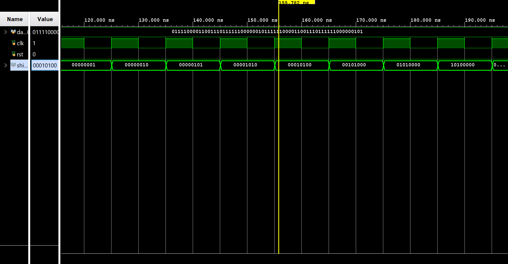

# Standing and Running Averages Module

This project implements real-time averaging operations on a stream of digital data using **structural Verilog RTL design**. It includes both **Standing Average** and **Running Average** modules built from reusable hardware primitives.

---

## Register (8-bit)

### Description
- A serial-in parallel-out (SIPO) shift register.
- Collects 8 incoming serial bits and outputs them as a parallel byte.
- Built structurally using `FDRE` flip-flops chained with enable logic.

---

## Dynamic Adder

### Description
- Adds up to 8 bits from the register module.
- Dynamically supports output widths of 8, 9, 10, or 11 bits depending on the number of active bits.
- Designed using structural Verilog using chained full adders and bitwise carry propagation.

---

## Standing Average

### Description
- Computes the average of the complete 8-bit word output from the register.
- Triggers an update every 8 clock cycles once the register is full.
- The sum from the dynamic adder is right-shifted (divided by 8) to produce the average.
- Implemented with fixed-point integer arithmetic.

---

## Running Average

### Description
- Continuously updates the average using a rolling 8-bit window.
- With each new bit shifted in, the oldest bit is discarded and the average is updated.
- Efficient implementation for real-time streaming data scenarios.
- Structural Verilog used with bit rotation and control logic.

---

## Output Waveforms

### Register Output

---

### Dynamic Adder Output

---

### Standing Average Output

---

### Running Average Output

---

## Output Verification

- **Simulated in Vivado**: All modules were tested using custom testbenches.
- **Truth Table Matching**: Output results were manually verified against expected values.
- **Precision Validation**: Output widths and results were confirmed to handle full-scale 8-bit inputs correctly.
- ❗ **Note**: Modules were **not tested on the Basys 3 board** or other FPGA hardware platforms.
